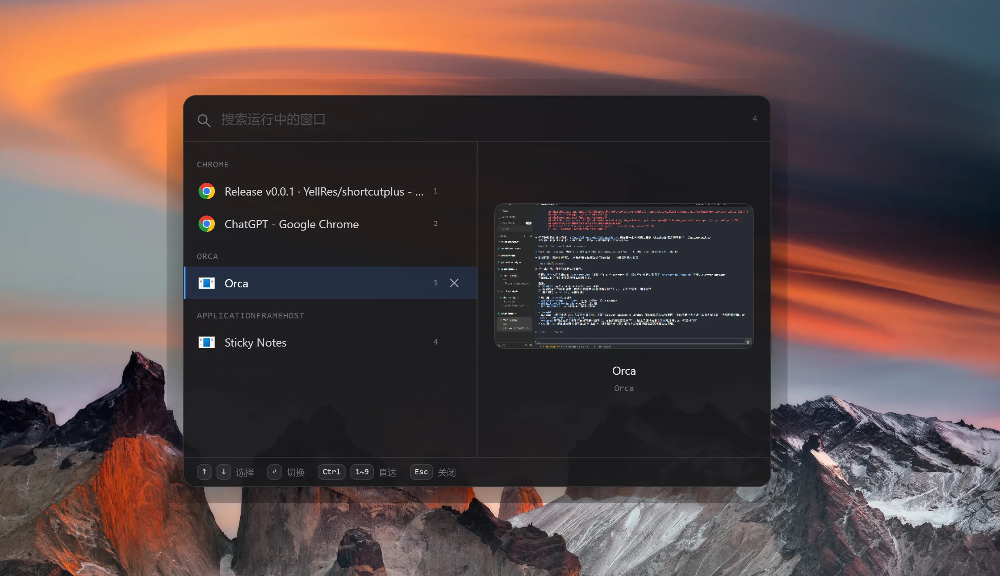

# AltSwitch

> A fast, keyboard-first `Alt+Tab` replacement for Windows. A Spotlight-style window switcher that groups your open windows by app, lets you search them, and switches instantly.

[](LICENSE)
[English](README.md) · [中文](README.zh-CN.md)

<p align="center"></p>

## Features

- **Command-palette UI** - summon a centered overlay, type to filter, navigate entirely from the keyboard.
- **Grouped by application** - windows are grouped by their owning process so a 12-tab mess stays readable.
- **Live thumbnails** - preview the selected window; minimized windows fall back to their last-seen frame, then to the app icon.
- **Keyboard model** - `↑`/`↓` to move, `↵` to switch, `Esc` to dismiss, type anything to filter.
- **Lightweight native layer** - window enumeration and switching go through Win32 via [koffi](https://koffi.dev/) (no Python / Visual C++ build toolchain needed to install).

## Requirements

- Windows 10 or 11 (x64)

## Install

Download the latest build from the [Releases page](https://github.com/YellRes/shortcutplus/releases):

- **Installer** - `AltSwitch-Setup-x.y.z.exe` (NSIS, lets you choose the install location and creates shortcuts)
- **Portable** - `AltSwitch-x.y.z-win.zip` (unzip and run, no install)

## Usage

1. Press **`Alt+4`** to summon the switcher (press again to dismiss).
2. Type to filter the open windows.
3. Use **`↑` / `↓`** to move the selection across groups.
4. Press **`↵`** to switch to the selected window, or click it.
5. Press **`Esc`** (or click away) to dismiss.

## Build from source

```bash
pnpm install        # koffi ships prebuilt binaries; no Python / VC++ needed
pnpm dev            # run in development (renderer dev server + auto-rebuilt main/preload)
pnpm dist           # build a Windows installer + portable zip into release/
```

## Tech stack

- **Electron 19** + **Vue 3** + **TypeScript** + **Vite**
- **Tailwind CSS** for the UI (no component library)
- **koffi** for Win32 native calls; **desktopCapturer** for window thumbnails

## How it works

The main process enumerates true `Alt+Tab` windows with `EnumWindows` (filtering the shell window, DWM-cloaked windows, and tool windows), reads each window's title and owning process via Win32, and exposes them to the Vue UI over IPC. Switching calls `ShowWindow` + `SetForegroundWindow`. Thumbnails use Electron's `desktopCapturer`, matched to each window by its `HWND`, with a cache so minimized windows still show their last-known frame.

## Contributing

Issues and pull requests are welcome. This is a Windows-only project today; a cross-platform (macOS) rewrite is being explored separately. Please keep changes focused and run `pnpm dev` to verify before opening a PR.

## License

[MIT](LICENSE). Inspired by [Alt Tab Terminator](https://www.ntwind.com/software/alttabter.html).
